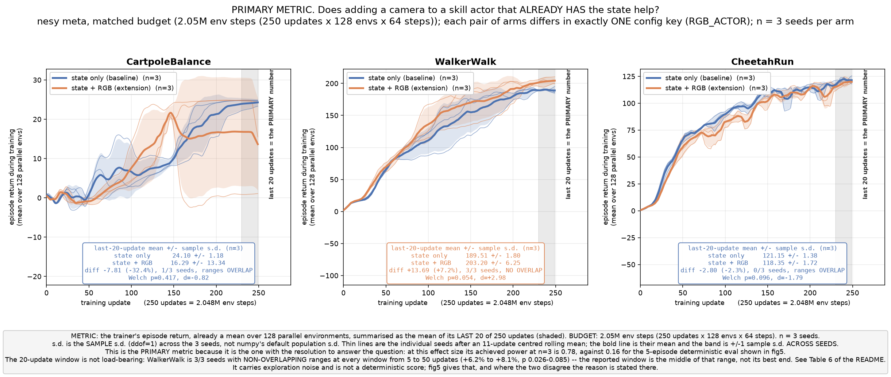
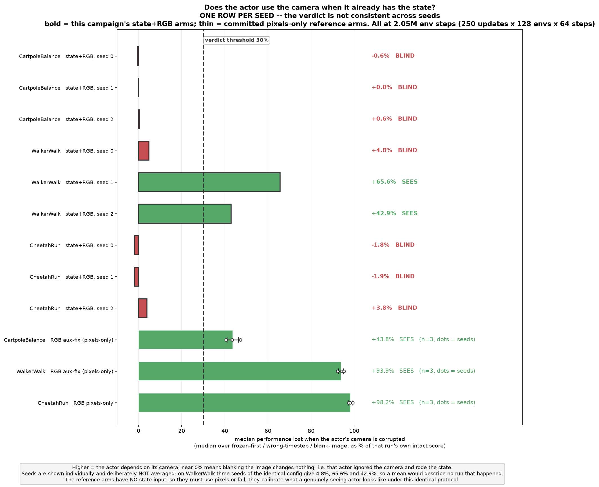
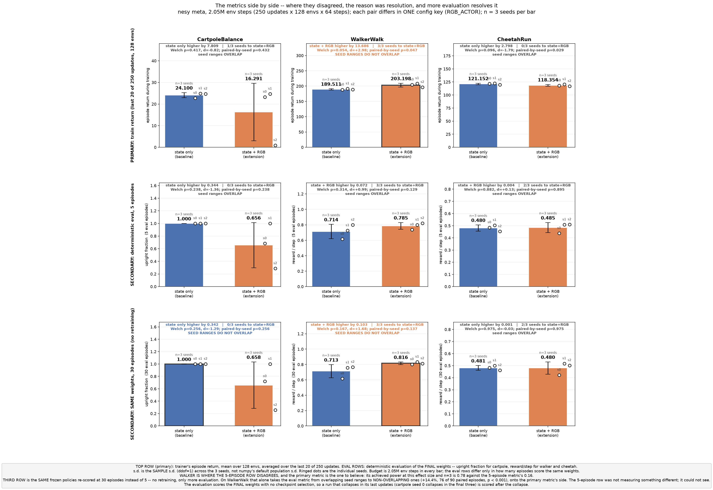
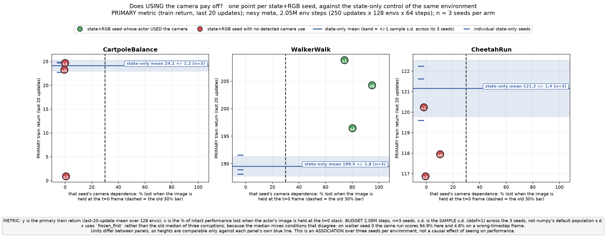
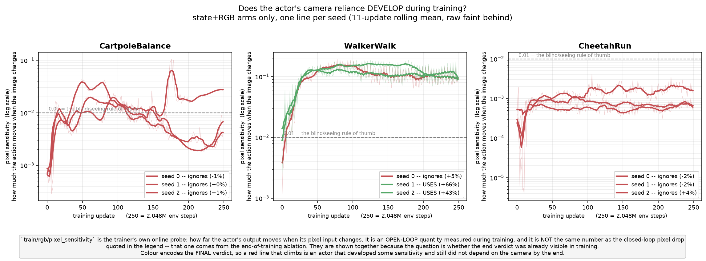
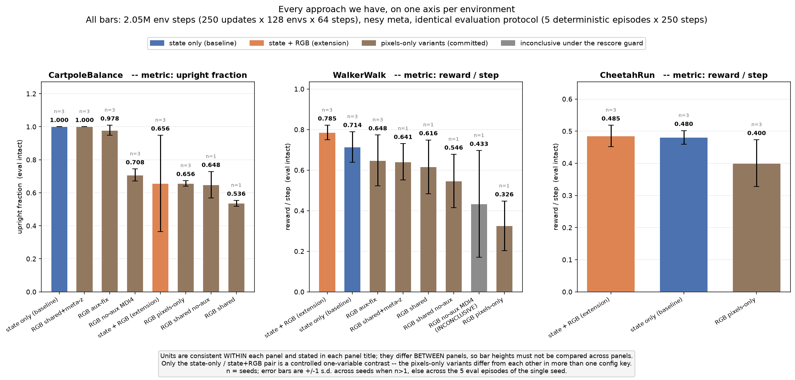
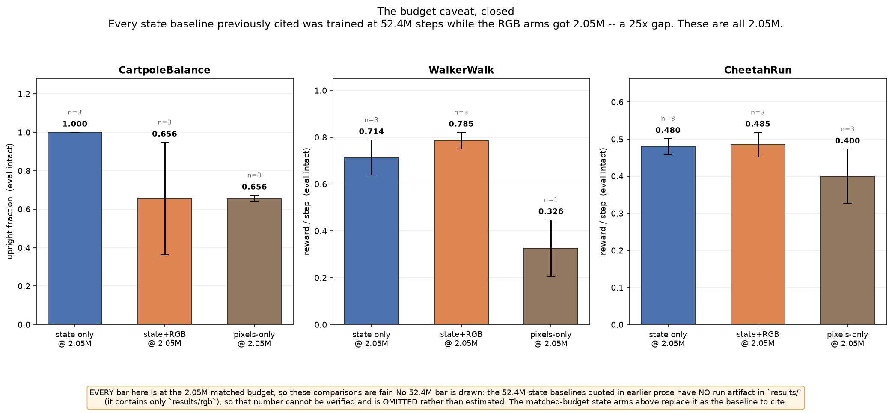
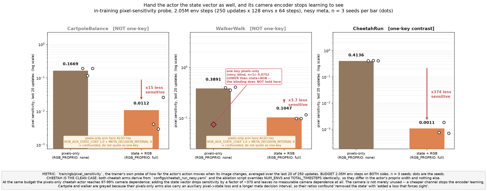

# Does giving the skill actors a camera help?

**RGB extension findings** — branch `rgb-plus-state` · 3 envs × 2 arms × 3 seeds · 2.05M env steps each
Full detail: [`rgb_extension_team_briefing.txt`](rgb_extension_team_briefing.txt) · Raw data: `results/rgb/state_plus_rgb/`

**The question:** a NEXUS skill actor already reads the state vector. Does *adding* a 64×64 camera on
top of it improve performance?

---

## The answer

**It depends on the environment, and it is not a wash.** Primary metric is training return
(mean of the last 20 of 250 updates, each already a mean over 128 parallel envs); ± is the sample s.d.
across 3 seeds.

| env | training return (state only → state+RGB) | Δ | 30-ep eval | camera used by actor |
|---|---|---|---|---|
| **CartpoleBalance** | 24.10 ± 1.18 → 16.29 ± 13.34 | −32% | 1.000 → 0.658 | ignored 3/3 |
| **WalkerWalk** | 189.51 ± 1.80 → **203.20 ± 6.25** | **+7.2%** | 0.713 → 0.816 | **used 3/3** |
| **CheetahRun** | 121.15 ± 1.38 → 118.35 ± 1.72 | −2.3% | 0.481 → 0.480 | ignored 3/3 |

*Eval metric is upright fraction for cartpole, reward/step for walker and cheetah — not comparable across rows.*

- **Walker: the camera helped.** +7.2%, all 3 seeds better, seed ranges do not overlap
  (worst extension seed 196.5 > best baseline seed 191.5). Welch p = 0.054, d = +2.98,
  paired-by-seed p = 0.047. At a 30-episode deterministic eval, **+14.4%**, also non-overlapping.
- **Cartpole: a stability finding, not a lower ceiling.** One seed finished at 0.9999 upright
  fraction — parity. Two collapsed late and were scored after the collapse.
- **Cheetah: a small consistent cost**, 1–3% depending on the averaging window, and nothing at all
  at evaluation (−0.2%, p = 0.97).

> **Two limits bind every number above.** The runs are **undertrained** (4–21% of this project's own
> configured budgets; nothing plateaued) and **n = 3 seeds**. Read [Caveats](#caveats--read-these-before-quoting-anything-above)
> before quoting any of this.



---

## Setup, compressed

Hierarchical PQN, `nesy` meta-policy in **both** arms (the extension does not touch the meta layer).

| | baseline (`state_matched`) | extension (`state_plus_rgb`) |
|---|---|---|
| skill actor input | `actor(state)` | `actor(CNN(pixels) ⊕ state)` — 128-d latent **concatenated**, state never replaced |
| critics, meta-policy | privileged state | privileged state (unchanged) |
| config difference | — | **exactly one key: `RGB_ACTOR: false → true`** |

The configs are machine-generated by `tools/gen_state_plus_rgb_configs.py`, which asserts the one-key
property before writing; a `diff` of each pair today returns the `RGB_ACTOR` line and one comment line.

**Both arms keep `USE_RGB: true`.** In MuJoCo Playground `vision` is a *task* switch, not a rendering
switch — it changes the reward function, `ctrl_dt`, episode length, termination rule and state
representation. A `USE_RGB: false` control would have compared two different **tasks**. `RGB_ACTOR`
separates "the environment renders" from "the actor consumes", so the two arms are bit-for-bit
identical apart from the actor's camera pathway. The cost: the baseline pays the rendering bill
without using the image, so it is a fair *control* but not a throughput-optimal state-only run.

**"RGB" is a misnomer.** The image is **64 × 64 grayscale, 3 stacked frames** (the stack is how
velocity reaches the actor). Encoder is DrQ-v2 style → 128-d latent; not shared, so every skill actor
carries its own CNN: **~0.61M added parameters per skill** (1.8M–2.5M per run) and 128 extra input
dimensions — on cartpole that is 128 of the actor's 132 inputs.

---

## Why the split: interpretation

*Everything in this section is interpretation. The measurements are above and in the long report.*

**The split tracks exactly one thing: whether the actor learned to use its camera.** Two independent
probes agree on all nine extension runs, with no disagreement between seeds within an environment.

| env | `frozen_first` corruption cost (per seed) | in-training pixel sensitivity (per seed) | verdict |
|---|---|---|---|
| walker | +0.721 / +0.622 / +0.723 | 0.098 / 0.099 / 0.117 | **uses the camera** |
| cartpole | −0.003 / +0.000 / −0.002 | 0.0042 / 0.0030 / 0.0263 | noise floor |
| cheetah | −0.011 / +0.000 / +0.020 | 0.00076 / 0.00185 / 0.00071 | noise floor |

Where the camera was used, performance improved. Where it was not, it was dead weight — neutral on
cheetah, destabilising on cartpole. With three environments this is an **association**, not a
demonstration of causation.



**A plausible mechanism.** On these three environments the state vector is small (4–18 numbers),
exact and complete: `qpos + qvel` fully determines the physical configuration. A 64 × 64 grayscale
render is a **lossy re-encoding of information the actor already has**. It adds no information but
still costs ~0.61M parameters per skill and 128 nuisance input dimensions that the optimiser must
learn to *suppress* rather than exploit. Under this reading, cartpole and cheetah are the expected
outcome and **walker is the result that needs explaining** — either the camera is a genuinely useful
redundant view for a contact-rich task, or the extra pathway acts as a regulariser at this short
budget. Not distinguished here.

Note also what replicates on walker: `frozen_first` (a valid scene that stops *changing*) is fatal on
all three seeds, while `shuffle_frames` (pose preserved, temporal order destroyed) costs nothing
(−0.013 / +0.019 / +0.014). That is dependence on the image **changing**, not on it being correct or
correctly ordered — closer to a motion signal than to a pose reconstruction.

---

## Caveats — read these before quoting anything above

**1. Undertrained. Nothing plateaued.** Improvement over the final 20% of training relative to the
preceding 20% (mean over seeds):

| env | state only | state + RGB |
|---|---|---|
| cartpole | **+46.2%** | n/a (two seeds collapsed) |
| walker | +13.1% | +13.2% |
| cheetah | +6.1% | +6.1% |

Against this project's own configs we ran **21%** of the cartpole budget (2.05M of 9.83M) and **4%**
of the walker and cheetah budget (2.05M of 52.4M). The comparison is **fair** — both arms got
identical budgets — but the conclusion holds **at that budget only**. The effect could grow, vanish
or reverse with more training. A 52.4M-step walker run is in progress and is **not** included here.

**2. n = 3.** Walker's p = 0.054 does not clear 0.05. With 3 vs 3, an unpaired permutation test cannot
return a two-sided p below 2/20 = **0.10** regardless of effect size (walker's is exactly 0.10, the
floor), and a sign test cannot go below 0.25. "Not significant" here reflects the sample size, not a
weak effect — d = +2.98 with disjoint seed ranges. Power analysis: **n = 4 per arm** would settle the
primary metric. One more seed.

**3. Only `nesy` was tested.** The NEXUS paper evaluates three meta-policy variants and advocates the
purely **symbolic** one. The skill actors are identical across all three variants, so the extension
*should* transfer — but that is an architectural argument, not a measurement. It was not verified.

**4. A metric lesson.** This was first reported on a 5-episode deterministic eval whose achieved
power was **0.16**, on which walker showed "no effect" (overlapping ranges, p = 0.31). Re-scoring the
**same frozen weights** at 30 episodes — no retraining, same rollout code, same reset keys — moved
walker to non-overlapping ranges and +14.4%. The metrics never disagreed about the world; one of them
could not see the difference and reported that absence as a null. Both are shown side by side below.



**5. Cartpole's 30-ep "non-overlapping" flag is degenerate.** The baseline is exactly 1.0000 on all
three seeds (zero variance, at the metric's ceiling) against a best extension seed of 0.9999. Formally
disjoint by one part in ten thousand — a ceiling artifact, not a separation. Do not quote it.

**6. Do not quote `const_action`.** For an `RGB_PROPRIO: full` actor it replaces the actor's *entire*
input, state included, so it is not a pixel-specific control. It is hatched out in fig2 for this reason.

Also, for the record: cartpole's collapses are real but not exclusive to the extension. Baseline seed 0
also dipped late (to 13.81 at update 201) and recovered. Extension seed 0 sat at ~24.5 for 240 updates
then fell apart in the final three (24.42 → 22.23 → 15.19 → 9.95) and was scored there; evaluation uses
final weights with no checkpoint selection.

---

## What to take away

1. **Adding a camera to a state-reading skill actor is not free and is not automatically useful.** It
   paid off on exactly the one environment where the actor demonstrably learned to read it.
2. **Measure whether the actor uses the camera before interpreting a performance number.** Two cheap
   probes (a `frozen_first` corruption at eval, and the in-training sensitivity monitor) separated the
   three environments cleanly and explained the whole result.
3. **Nothing here speaks to the case the extension is actually for** — a task where the state vector
   is incomplete or where the camera carries information the state does not. All three environments
   have small, exact, complete state vectors.
4. **The two things worth doing next**, in order: one more seed (n = 4 settles the primary metric), and
   the 52.4M-step walker run to test whether +7.2% survives a real budget.

---

## Reproduce and explore

```bash
python tools/gen_state_plus_rgb_configs.py       # regenerates configs, asserts one-key property
tools/run_state_plus_rgb_campaign.sh cartpole:state_matched:0 ...   # training, 18 arms, GPU
tools/run_state_plus_rgb_eval30.sh walker:state_plus_rgb:0 ...      # re-score frozen policies at 30 eps
python tools/analyze_state_plus_rgb.py           # -> corrected_analysis.json (all statistics)
python tools/plot_state_plus_rgb_figures.py --figure all            # all 8 figures, CPU only
```

`analyze_state_plus_rgb.py` recomputes every statistic from the committed raw JSONs and records the
source path of every input. No result JSON is ever rewritten.

---

## The remaining figures

### fig3 — camera use vs performance

Each point is one state+RGB seed: how much it depended on its camera (x) against how it scored (y),
with its own environment's state-only baseline as the horizontal line. Walker's camera-using seeds sit
above their baseline; cartpole's and cheetah's sit at x ≈ 0. **This shows association across nine
seeds, not causation** — and the ordering within walker is not monotone.



### fig4 — pixel sensitivity during training

How much each actor's output moved when its input image changed, tracked across all 250 updates.
Walker climbs to 0.098–0.117; cartpole and cheetah stay at the noise floor. This is measured
independently of the corruption ablation, so it is a second, agreeing probe rather than a restatement.



### fig6 — all variants on one axis

Every arm this project produced, placed on a common axis per environment. Useful for orientation only:
**these are not controlled contrasts.** The pixels-only arms come from a superseded campaign at
different settings, so vertical distance between them and the state arms is not a clean comparison.



### fig7 — every arm at the same budget

Earlier write-ups compared state baselines trained at 52.4M steps against RGB arms trained at 2.05M —
a 25× gap that made the comparison meaningless. **Every bar here is 2.05M**, which is what closes it.
The third bar per panel is the superseded pixels-only arm, shown for context.

Two things this does *not* show: it uses the 5-episode eval (the secondary metric, the only axis the
pixels-only arms share with the pair), and **no 52.4M bar is drawn** — those baselines have no run
artifact in `results/`, so the number is omitted rather than estimated. Note this figure is about
*matching* budgets, not about whether 2.05M was *enough* — on that, see caveat 1.



### fig8 — encoder blinding

On cheetah, the same encoder reaches 0.41 sensitivity with pixels alone but 0.0011 when the state
vector is also available — it stops learning to see once an easier input exists. **This does not
generalise:** walker's own pixels-only run points the other way, and only cheetah is a one-key
contrast. Shown because the contradiction is worth seeing, not because the effect is established.



---

- **Videos.** 11 mp4 files in [`results/rgb/state_plus_rgb/video/`](../../results/rgb/state_plus_rgb/video/):
  seven per-arm 250-step greedy rollouts and four side-by-side pairings, generated from the saved
  policies with no retraining. A single rollout is an illustration, not a measurement.
- **Full detail.** [`docs/reports/rgb_extension_team_briefing.txt`](rgb_extension_team_briefing.txt) —
  every per-seed number, the averaging-window sweep, the statistics conventions, and what was removed
  from earlier versions of this campaign and why.
