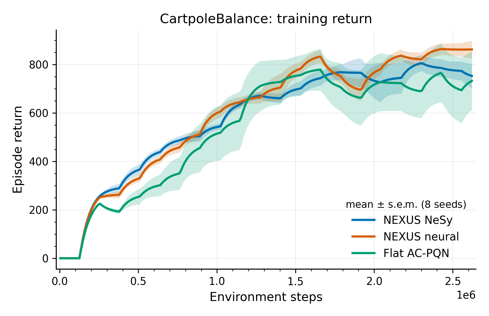
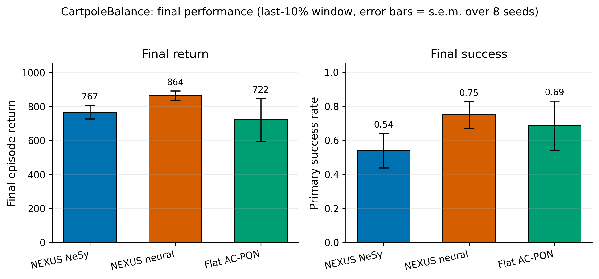

# CartpoleBalance: NEXUS vs flat baseline (paper-grade demo)

Publication-quality figures rendered offline from the W&B run histories with
`tools/paper_figures_from_wandb.py`. Source runs: project
`mamba-rl/nexus-cartpole-paper`, **8 seeds per variant**, 2.62M environment steps,
DDPG-style AC-PQN skills.

## Training return



Mean over 8 seeds; shaded band is the standard error of the mean. All three
variants reach a high-return balancing policy; NEXUS-neural and NEXUS-NeSy track
each other and the flat AC-PQN baseline is competitive but noisier late in training.

## Final performance



Aggregated over the last 10% of training (per seed), error bars are s.e.m. over 8
seeds.

| Variant | Final return | Final primary success |
| --- | ---: | ---: |
| NEXUS neural | 864 | 0.75 |
| NEXUS NeSy | 767 | 0.54 |
| Flat AC-PQN | 722 | 0.69 |

## Honest reading

CartpoleBalance is an easy task and does **not** separate the methods: neural is
marginally best, the flat baseline is competitive, and NeSy is slightly behind on
success here. This is consistent with `continuous_nexus_phase2_results.md`, where
CartpoleBalance misses the strict deterministic-success threshold. These figures are
a presentation-quality *demonstration of the plotting/aggregation pipeline*, not
evidence that NeSy wins on this environment. The environments that actually
differentiate the methods (e.g. CheetahRun) should be rendered the same way for a
paper.

## Reproduce

```bash
# 8 seeds x 3 variants (real GPU training, W&B tracking on by default)
for v in nesy:cartpole_balance_nesy neural:cartpole_balance_neural flat:flat_cartpole_balance; do
  python -m nexus_continuous.scripts.train_nexus_playground --config configs/${v##*:}.yaml \
    --override NUM_SEEDS=8 --override TOTAL_TIMESTEPS=2621440 \
    --override WANDB.project=nexus-cartpole-paper --override WANDB.group=${v%%:*}
done
# Render paper figures (PNG + PDF)
python tools/paper_figures_from_wandb.py --entity mamba-rl --project nexus-cartpole-paper --out runs/paper_figs_final
```
