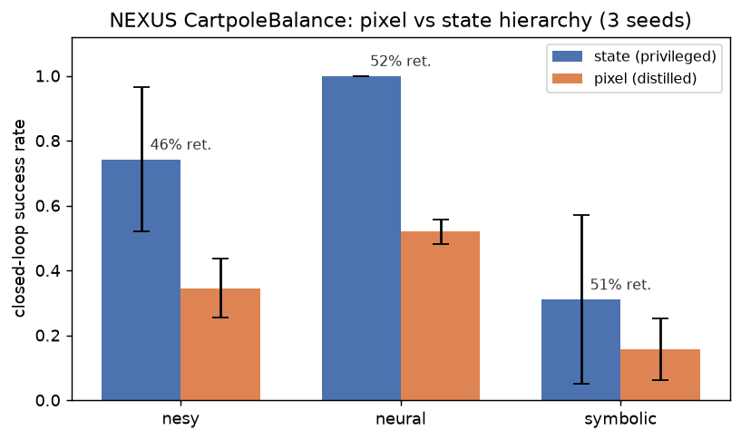

# RGB skill-agent extension — results

> **UPDATE (2026-08-19) — READ BEFORE TRUSTING THE IN-LOOP NUMBERS BELOW.**
> A pixel-dependence ablation campaign (corrupt *only* the actor's camera input
> and see if performance survives) found that the **CartpoleBalance in-loop
> result below (0.64 eval success) is BLIND** — the actor's action barely
> moves when the image is frozen, scrambled, or blanked, and a policy with the
> actor removed entirely scores *better*. The privileged meta-policy was doing
> the work, not vision. **CheetahRun and WalkerWalk in-loop are independently
> verified genuinely pixel-driven** (corrupting the camera collapses
> performance 93-99%, confirmed on 3 seeds each). **HopperHop is inconclusive**
> (its score is statistical noise around zero, so there is no signal to test).
> A fix (auxiliary pixel→state loss + a longer meta-decision interval) was
> found and verified to repair the cartpole blindness completely — see
> `ablation/cartpole/nesy_fixed_seed0/` (perfect upright fraction, 3/3 seeds) and the
> same fix independently rescued 3 previously-saturated WalkerWalk skills too
> (`ablation/walker/nesy_fixed_seed0/`). **Full findings, all figures, every number:
> [`ablation/`](ablation/) and
> [`../../docs/reports/rgb_extension_team_briefing.txt`](../../docs/reports/rgb_extension_team_briefing.txt).**
> The numbers below are kept as the original historical record (nothing was
> deleted) but should be read through the correction above, not at face value.

> **THE BASELINE-VS-EXTENSION QUESTION IS ANSWERED IN
> [`state_plus_rgb/figures/README.md`](state_plus_rgb/figures/README.md).**
> Everything above and below tests pixels *replacing* the state. A separate
> campaign tests the paper's actual suggestion -- pixels *added to* the state
> (`RGB_PROPRIO: full`) against a state-only control at an identical
> environment-step budget, 3 envs x 2 arms x 3 seeds, with the two arms'
> configs differing in exactly one key. Its answer is per-environment and does
> not generalise:
> **WalkerWalk the camera HELPS** (+7.2% training return, 3/3 seeds,
> non-overlapping, p = 0.054, and the actor demonstrably uses the camera);
> **CheetahRun a small consistent cost** and, more interestingly, adding the
> state vector makes the encoder ~370x less pixel-sensitive than the
> pixels-only arm at the same budget -- a cheaper channel stops perception
> being learned at all; **CartpoleBalance parity when training was stable**,
> with 2 of 3 seeds collapsing late.
> That README is a CORRECTED version: the first write-up quoted a 5-episode
> eval whose achieved power was 0.16 where the training return's was 0.78, and
> binarised camera use with a threshold calibrated on a different actor type.
> Both are fixed there, with the original JSONs untouched on disk and the
> recomputation in `state_plus_rgb/corrected_analysis.json`.

Two ways to give NEXUS's disentangled skills **raw-pixel** input while keeping the
interpretable meta-policy on privileged state (asymmetric / privileged-critic
design, Pinto et al. 2017):

1. **Distillation** (`rgb_distill_nexus.py`) — train state NEXUS, then behavior-clone
   each skill into a `VisionSkillActor` (Learning-by-Cheating, Chen et al. 2020).
   Renders offline, so it runs on any env: CartpoleBalance (3 meta variants) + CheetahRun.
2. **In-loop pixel RL** (`USE_RGB`, `*_rgb.yaml`) — train the skill actors *directly*
   from MJWarp-rendered pixels, end to end. Needs `mujoco-warp==3.11.0` + the render
   shims (see top-level README); works for CartpoleBalance (framework) and CheetahRun
   (our `CheetahRunVision` port).

**Headline comparison (ORIGINAL, see the correction banner above)** — in-loop
pixel RL scores higher than distillation on both environments by raw number,
but this table does NOT mean both wins are vision-driven:

| env | privileged state teacher | distillation → pixels | in-loop pixel RL |
|-----|--------------------------|-----------------------|------------------|
| CartpoleBalance | 1.00 upright | 0.52 upright | **0.64 eval success** ⚠️ later found BLIND, see ablation/ |
| CheetahRun | 0.62 reward/step | 0.16 reward/step | **~0.42 reward/step** ✅ verified pixel-driven |

CheetahRun's in-loop win is real and vision-driven (jointly learned perception +
control beats behavior cloning, as originally hypothesized). CartpoleBalance's
in-loop win is real *in score* but NOT vision-driven — the ablation campaign
found the privileged meta-policy solves that task alone, so the actor never had
to learn to see; a fix now makes it genuinely vision-driven too (perfect upright
fraction, `ablation/cartpole/nesy_fixed_seed0/`). Details for each method below.

## In-loop pixel RL (skills trained directly from MJWarp pixels)

> **Artifact note.** The rendered PNGs of this first pass (the two learning
> curves, the render probe, and the per-env filmstrips/timelines) were deleted
> in commit `8333c39`. The numbers behind them are untouched and still on disk:
> `inloop/cartpole_inloop.json`, `inloop/cheetah_inloop.json`, and
> `inloop/viz_{hopper,walker}/inloop_curve.json`.

In-loop pixel RL was run on **all four environments** (one seed; 128 envs / 250
updates for the headline cartpole/cheetah runs, 96 envs / 200 updates for the
visualized walker/hopper rollouts):

| env | in-loop result | notes |
|-----|----------------|-------|
| CartpoleBalance | **0.64 eval success** | ⚠️ later found BLIND (privileged meta did the work, not vision) — fixed in `ablation/cartpole/nesy_fixed_seed0/` (perfect upright, verified pixel-driven, 3/3 seeds) |
| CheetahRun | **~0.42 reward/step** (return 0→~110) | ✅ learns to run from pixels, verified (93-99% collapse when camera corrupted, 3/3 seeds) |
| WalkerWalk | **~0.40 reward/step** (return 0→~90) | ✅ overall verified pixel-driven, BUT only 1 of 4 skills was actually responsive pre-fix (3 were saturated/blind); fixed in `ablation/walker/nesy_fixed_seed0/` (all 4 skills responsive, 3/3 seeds) |
| HopperHop | **~0.00 reward/step** (return ~0) | **failed to learn** — and the ablation later confirmed this score is statistical noise (inconclusive), not a testable pixel-dependence result |

- Cartpole / cheetah / walker all **beat the distilled pixel policy** on the same env by
  raw score, but only cheetah and (mostly) walker's win is attributable to "joint
  perception+control learning" — see the correction banner at the top of this file
  and `ablation/` for the full, ablation-verified picture.
- **HopperHop is the honest exception:** the single-leg hopper is inherently unstable
  — if the policy can't keep it upright the `standing×hopping` reward is exactly 0, and
  learning to hop from pixels at this budget is too hard. The render is correct (the
  fallen hopper is visible in `inloop/viz_hopper/`); it just doesn't learn. A useful
  negative result — **difficulty ordering: balance < walk/run < hop.**
- **Qualitative artifacts** for every env (`inloop/viz_{cartpole,cheetah,walker,hopper}/`):
  a **video** (`rollout_inloop.mp4`) of what the in-loop pixel policy sees,
  skill-annotated. Each rollout is self-checked (rollout reward matches the
  trained policy — 0.074 cartpole, 0.259 cheetah, 0.404 walker, 0.000 hopper),
  so the videos show the real trained policy. The accompanying observation
  filmstrip / skill-reward timeline / learning-curve PNGs were deleted in
  `8333c39`; walker's and hopper's curve data survives as
  `inloop/viz_{walker,hopper}/inloop_curve.json`.
  (These `inloop/` artifacts are the original, never-ablated first pass; the
  ablation campaign's own per-run qualitative artifacts live under each
  `ablation/<env>/<variant>/viz/`, see `ablation/README.md`.)
- **Enabled by:** `mujoco-warp==3.11.0` (version-aligned with mujoco 3.11 — the desync
  that blocked this on Colab is gone) + two runtime shims (`ensure_mjwarp_graphmode`,
  `ensure_mjx_render_compat`) + `dm_control_vision.py` (Cheetah/Walker/Hopper vision
  subclasses porting cartpole's render pipeline; tracking cameras were verified
  in-frame at the time — the `cheetah_render_probe.png` evidence image was
  deleted in `8333c39`).
- **Caveats:** single seed each; the locomotion numbers are *training* return (those
  configs have no greedy-eval stage); in-loop needs the MJWarp renderer.

## Distillation (privileged-critic behavior cloning)

**Design (asymmetric / privileged-critic, Pinto et al. 2017).** The meta-policy,
critics, and meta-Q keep reading privileged state; only the skill *actors* move to
pixels. For each meta variant we (1) train state NEXUS, (2) roll it out recording
`(frame, meta-selected skill, action)`, (3) behavior-clone each skill into a
`VisionSkillActor` (Learning-by-Cheating, Chen et al. 2020), (4) run closed-loop
where the unchanged meta selects skills from state and the **pixel** students act.



| meta | state success | pixel success | retention | pixel-fallback |
|------|---------------|---------------|-----------|----------------|
| nesy     | 0.743 ± 0.221 | 0.345 ± 0.092 | 0.46 | 0.008 |
| neural   | 1.000 ± 0.000 | 0.520 ± 0.038 | 0.52 | 0.008 |
| symbolic | 0.311 ± 0.260 | 0.157 ± 0.094 | 0.51 | 0.023 |

*3 seeds each; success = fraction of 250 closed-loop steps with the pole upright
(|θ| < 0.25 rad) and cart centered (|x| < 1.0). Retention = pixel / state.
Pixel-fallback = fraction of steps a rarely-used skill (< 64 samples) kept the
privileged teacher — near-zero, so the comparison is genuinely pixel-driven.*

## Findings

1. **Distillation is near-exact per skill.** Behavior-cloning MSE is `1e-4`–`2e-3`
   for well-sampled skills; the vision CNN reproduces each skill actor's outputs.
2. **~50 % of privileged success is retained across *all three* meta variants** —
   the RGB skill extension is **meta-agnostic**. It rides on the shared skill
   actors, independent of how the high level selects them.
3. **The ~50 % gap is compounding error + partial observability** (Ross et al.
   2011), not a distillation failure: a 3-frame 64×64 grayscale stack carries
   coarser velocity information than the exact state, and small per-step action
   errors accumulate over a 250-step precision-critical balance task.
4. **Teacher strength orders as expected:** `neural` (1.00 state) ≥ `nesy` (0.74)
   ≫ `symbolic` (0.31). The rule-based symbolic meta collapses skill usage to
   `recover_balance` (~96 %), which is why it is the weakest and highest-variance.

## Reproduce

Headless GPU (see the "Headless rendering on a shared GPU" recipe in the top-level
[`README.md`](../../README.md) for the software-EGL / llvmpipe setup):

```bash
for META in nesy neural symbolic; do
  python -m nexus_continuous.scripts.rgb_distill_nexus \
    --config configs/cartpole_balance_${META}.yaml --meta ${META} \
    --seeds 0,1,2 --out runs/rgb_nexus_${META}
done
python -m nexus_continuous.scripts.rgb_report --runs runs \
  --metas nesy,neural,symbolic --out runs/rgb_report
```

## Second environment: CheetahRun (generalization)

The same BC-distillation pipeline runs on a second, harder env by rendering the
locomotion side (tracking) camera offline — showing the RGB extension is not tied
to the single framework-vision env. Here the metric is **mean per-step task reward**
(env-agnostic; cartpole's upright rate has no locomotion analogue), retention =
pixel / state, 3 seeds. `distill/multienv/*.json` holds the per-seed records; qualitative
artifacts (running-cheetah video, skill timeline, filmstrip, fidelity scatter) are
in `distill/viz_cheetah/`.

| env / meta | state reward/step | pixel reward/step | retention |
|------------|-------------------|-------------------|-----------|
| CartpoleBalance neural | 0.98 | 0.83 | **0.84** |
| CheetahRun neural      | 0.62 | 0.16 | **0.25** |
| CheetahRun nesy        | 0.56 | 0.10 | **0.17** |

**Finding:** on the same reward metric, pixel skills retain ~84 % of privileged
performance on balancing (CartpoleBalance) but only ~25 % on locomotion
(CheetahRun) — running needs precise gait timing that is much harder to recover
from a coarse 64×64 grayscale stack. Open-loop imitation stays near-perfect on both
(held-out Pearson r ≈ 0.99), so the gap is closed-loop precision, not cloning
quality. The `stabilize_posture` skill is rarely used (~2 % of steps) and clones
poorly; `accelerate_forward` / `energy_efficient_run` dominate and clone well.

*Metric note:* CartpoleBalance retention is ~0.84 under mean-reward but ~0.5 under
the stricter upright-fraction metric (the main table above) — the reward metric
gives partial credit for a pole that is up-but-drifting. Absolute numbers also vary
run-to-run (GPU nondeterminism in teacher training); the retention *ordering*
(balancing ≫ locomotion) is stable.

## Files

- `distill/` — **distillation** (Method A) results:
  - `comparison.png` — grouped state-vs-pixel bar chart (cartpole, 3 variants).
  - `results_table.md` — the cartpole table (upright metric), machine-generated.
  - `combined.json` — cartpole per-seed records (upright metric).
  - `{nesy,neural,symbolic}_state_vs_pixel.png` — per-variant single-panel figures.
  - `viz_cartpole/` — cartpole distillation qualitative artifacts (video, filmstrip, skill timeline, scatter).
  - `viz_cheetah/` — CheetahRun distillation qualitative artifacts (same set).
  - `multienv/*.json` — return-based distillation summaries used in the cross-env table above.
- `inloop/` — **in-loop pixel RL** (Method B) original, never-ablated results:
  `cartpole_inloop.json` and `cheetah_inloop.json` (learning curves +
  eval/return), and `viz_{cartpole,cheetah,walker,hopper}/`, each holding the
  in-loop rollout **video** `rollout_inloop.mp4` (walker and hopper also keep
  `inloop_curve.json`). The rendered PNGs that used to sit alongside these —
  `cartpole_inloop_curve.png`, `cheetah_inloop_curve.png`,
  `cheetah_render_probe.png`, and the per-env filmstrip / skill-timeline /
  curve images — were deleted in `8333c39`; no figure or claim reads them.
- `ablation/` — the **pixel-dependence ablation campaign** (see the correction
  banner at the top of this file): per-run six-condition camera ablations,
  responsiveness probes, and cross-run summary figures, organized as
  `<env>/<meta>_<status>[_seedN]/`. See `ablation/README.md` for the naming
  legend.
- `state_plus_rgb/` — **state-only vs state+RGB at a matched budget** (the
  baseline-vs-extension comparison; second banner at the top of this file).
  `<env>/<arm>_seed<n>/` holds each arm's raw `pixel_ablation.json`
  (5-episode eval, six conditions) and `training_curves.json` (250 updates x
  128 envs) exactly as produced -- these are never rewritten.
  `figures/README.md` is the document to cite: both metrics side by side,
  the paired analysis, the per-condition camera table, and the
  per-environment conclusions. `corrected_analysis.json` is the same numbers
  machine-readable, with the source path of every input.
  `video/` holds captioned rollouts. Regenerate with
  `tools/analyze_state_plus_rgb.py --readme` and
  `tools/plot_state_plus_rgb_figures.py --figure all` (no GPU needed).
- `state_plus_rgb_eval30/` — the SAME 18 frozen policies from `~/runs_spr/`
  re-scored at 30 evaluation episodes instead of 5, no retraining
  (`tools/run_state_plus_rgb_eval30.sh`). Kept alongside the 5-episode runs
  rather than replacing them.

Run environment: TU student pool `mlsp2` (RTX 2080 Ti), jax 0.11 CUDA, mujoco 3.11 +
mujoco-warp 3.11; distillation renders offline via software-EGL (llvmpipe), in-loop
renders via MJWarp (CUDA).
