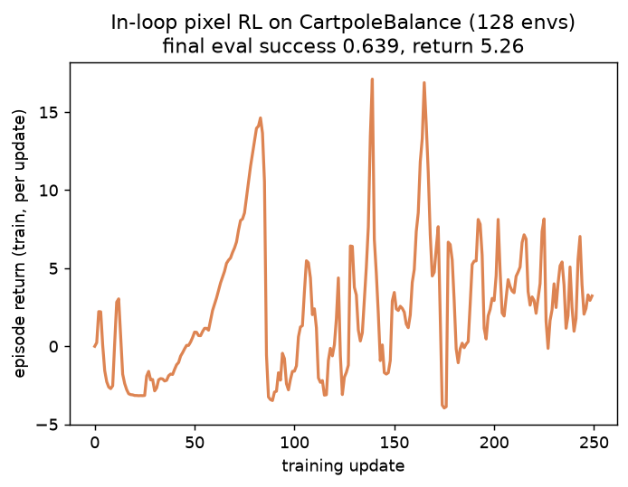
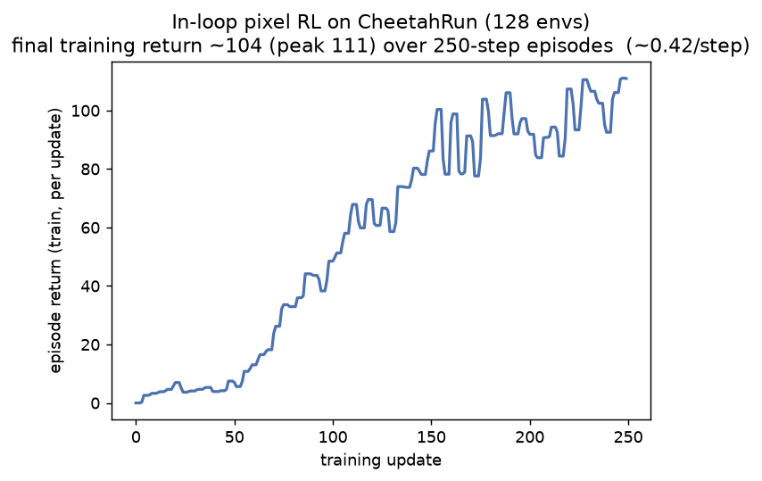

# RGB skill-agent extension — results

Two ways to give NEXUS's disentangled skills **raw-pixel** input while keeping the
interpretable meta-policy on privileged state (asymmetric / privileged-critic
design, Pinto et al. 2017):

1. **Distillation** (`rgb_distill_nexus.py`) — train state NEXUS, then behavior-clone
   each skill into a `VisionSkillActor` (Learning-by-Cheating, Chen et al. 2020).
   Renders offline, so it runs on any env: CartpoleBalance (3 meta variants) + CheetahRun.
2. **In-loop pixel RL** (`USE_RGB`, `*_rgb.yaml`) — train the skill actors *directly*
   from MJWarp-rendered pixels, end to end. Needs `mujoco-warp==3.11.0` + the render
   shims (see top-level README); works for CartpoleBalance (framework) and CheetahRun
   (our `CheetahRunVision` port).

**Headline comparison** — in-loop pixel RL beats distillation on **both** environments:

| env | privileged state teacher | distillation → pixels | in-loop pixel RL |
|-----|--------------------------|-----------------------|------------------|
| CartpoleBalance | 1.00 upright | 0.52 upright | **0.64 eval success** |
| CheetahRun | 0.62 reward/step | 0.16 reward/step | **~0.42 reward/step** |

In-loop wins because it learns perception + control **jointly**, while distillation is
capped by behavior cloning + covariate shift. Details for each method below.

## In-loop pixel RL (skills trained directly from MJWarp pixels)




- **CartpoleBalance:** eval success **0.639** (0.75 on another seed), return 5.26; the
  learning curve rises from ~0 to peaks ~15 over 250 updates (128 envs, one seed).
- **CheetahRun:** the config has no greedy-eval stage, but the **training return climbs
  0 → ~110** (≈ **0.42 reward/step**) over 250 updates — the pixel cheetah learns to
  run. That is ~68% of the state teacher's 0.62/step, vs distillation's ~26%.
- Both **beat the distilled pixel policy** on the same env (headline table). Same
  pattern on both: joint perception+control learning > behavior cloning.
- **Enabled by:** `mujoco-warp==3.11.0` (version-aligned with mujoco 3.11 — the desync
  that blocked this on Colab is gone) + two runtime shims (`ensure_mjwarp_graphmode`,
  `ensure_mjx_render_compat`) + a `CheetahRunVision` subclass that ports cartpole's
  render pipeline (cheetah's cameras track the body — verified, `inloop/cheetah_render_probe.png`).
  `walker`/`hopper` share cheetah's structure and could be added the same way.
- **Caveats:** single seed each; cheetah number is *training* return (no greedy eval in
  the config); in-loop needs the MJWarp renderer (offline-render distillation is the
  fallback for envs without a vision port). Absolute cheetah performance is modest —
  learning a running gait from pixels in 250 updates is hard.

## Distillation (privileged-critic behavior cloning)

**Design (asymmetric / privileged-critic, Pinto et al. 2017).** The meta-policy,
critics, and meta-Q keep reading privileged state; only the skill *actors* move to
pixels. For each meta variant we (1) train state NEXUS, (2) roll it out recording
`(frame, meta-selected skill, action)`, (3) behavior-clone each skill into a
`VisionSkillActor` (Learning-by-Cheating, Chen et al. 2020), (4) run closed-loop
where the unchanged meta selects skills from state and the **pixel** students act.


| meta | state success | pixel success | retention | pixel-fallback |
|------|---------------|---------------|-----------|----------------|
| nesy     | 0.743 ± 0.221 | 0.345 ± 0.092 | 0.46 | 0.008 |
| neural   | 1.000 ± 0.000 | 0.520 ± 0.038 | 0.52 | 0.008 |
| symbolic | 0.311 ± 0.260 | 0.157 ± 0.094 | 0.51 | 0.023 |

*3 seeds each; success = fraction of 250 closed-loop steps with the pole upright
(|θ| < 0.25 rad) and cart centered (|x| < 1.0). Retention = pixel / state.
Pixel-fallback = fraction of steps a rarely-used skill (< 64 samples) kept the
privileged teacher — near-zero, so the comparison is genuinely pixel-driven.*

## Findings

1. **Distillation is near-exact per skill.** Behavior-cloning MSE is `1e-4`–`2e-3`
   for well-sampled skills; the vision CNN reproduces each skill actor's outputs.
2. **~50 % of privileged success is retained across *all three* meta variants** —
   the RGB skill extension is **meta-agnostic**. It rides on the shared skill
   actors, independent of how the high level selects them.
3. **The ~50 % gap is compounding error + partial observability** (Ross et al.
   2011), not a distillation failure: a 3-frame 64×64 grayscale stack carries
   coarser velocity information than the exact state, and small per-step action
   errors accumulate over a 250-step precision-critical balance task.
4. **Teacher strength orders as expected:** `neural` (1.00 state) ≥ `nesy` (0.74)
   ≫ `symbolic` (0.31). The rule-based symbolic meta collapses skill usage to
   `recover_balance` (~96 %), which is why it is the weakest and highest-variance.

## Reproduce

Headless GPU (see the "Headless rendering on a shared GPU" recipe in the top-level
[`README.md`](../../README.md) for the software-EGL / llvmpipe setup):

```bash
for META in nesy neural symbolic; do
  python -m nexus_continuous.scripts.rgb_distill_nexus \
    --config configs/cartpole_balance_${META}.yaml --meta ${META} \
    --seeds 0,1,2 --out runs/rgb_nexus_${META}
done
python -m nexus_continuous.scripts.rgb_report --runs runs \
  --metas nesy,neural,symbolic --out runs/rgb_report
```

## Second environment: CheetahRun (generalization)

The same BC-distillation pipeline runs on a second, harder env by rendering the
locomotion side (tracking) camera offline — showing the RGB extension is not tied
to the single framework-vision env. Here the metric is **mean per-step task reward**
(env-agnostic; cartpole's upright rate has no locomotion analogue), retention =
pixel / state, 3 seeds. `multienv/*.json` holds the per-seed records; qualitative
artifacts (running-cheetah video, skill timeline, filmstrip, fidelity scatter) are
in `viz_cheetah/`.

| env / meta | state reward/step | pixel reward/step | retention |
|------------|-------------------|-------------------|-----------|
| CartpoleBalance neural | 0.98 | 0.83 | **0.84** |
| CheetahRun neural      | 0.62 | 0.16 | **0.25** |
| CheetahRun nesy        | 0.56 | 0.10 | **0.17** |

**Finding:** on the same reward metric, pixel skills retain ~84 % of privileged
performance on balancing (CartpoleBalance) but only ~25 % on locomotion
(CheetahRun) — running needs precise gait timing that is much harder to recover
from a coarse 64×64 grayscale stack. Open-loop imitation stays near-perfect on both
(held-out Pearson r ≈ 0.99), so the gap is closed-loop precision, not cloning
quality. The `stabilize_posture` skill is rarely used (~2 % of steps) and clones
poorly; `accelerate_forward` / `energy_efficient_run` dominate and clone well.

*Metric note:* CartpoleBalance retention is ~0.84 under mean-reward but ~0.5 under
the stricter upright-fraction metric (the main table above) — the reward metric
gives partial credit for a pole that is up-but-drifting. Absolute numbers also vary
run-to-run (GPU nondeterminism in teacher training); the retention *ordering*
(balancing ≫ locomotion) is stable.

## Files

- `comparison.png` — grouped state-vs-pixel bar chart (cartpole, 3 variants).
- `results_table.md` — the cartpole table (upright metric), machine-generated.
- `combined.json` — cartpole per-seed records (upright metric).
- `{nesy,neural,symbolic}_state_vs_pixel.png` — per-variant single-panel figures.
- `viz/` — cartpole distillation qualitative artifacts (video, filmstrip, skill timeline, scatter).
- `viz_cheetah/` — CheetahRun distillation qualitative artifacts (same set).
- `multienv/*.json` — return-based distillation summaries used in the cross-env table above.
- `inloop/` — **in-loop pixel RL** results: `cartpole_inloop_curve.png` + `.json`,
  `cheetah_inloop_curve.png` + `.json` (learning curves + eval/return), and
  `cheetah_render_probe.png` (verifies the cheetah tracking camera renders in-frame).

Run environment: TU student pool `mlsp2` (RTX 2080 Ti), jax 0.11 CUDA, mujoco 3.11 +
mujoco-warp 3.11; distillation renders offline via software-EGL (llvmpipe), in-loop
renders via MJWarp (CUDA).
