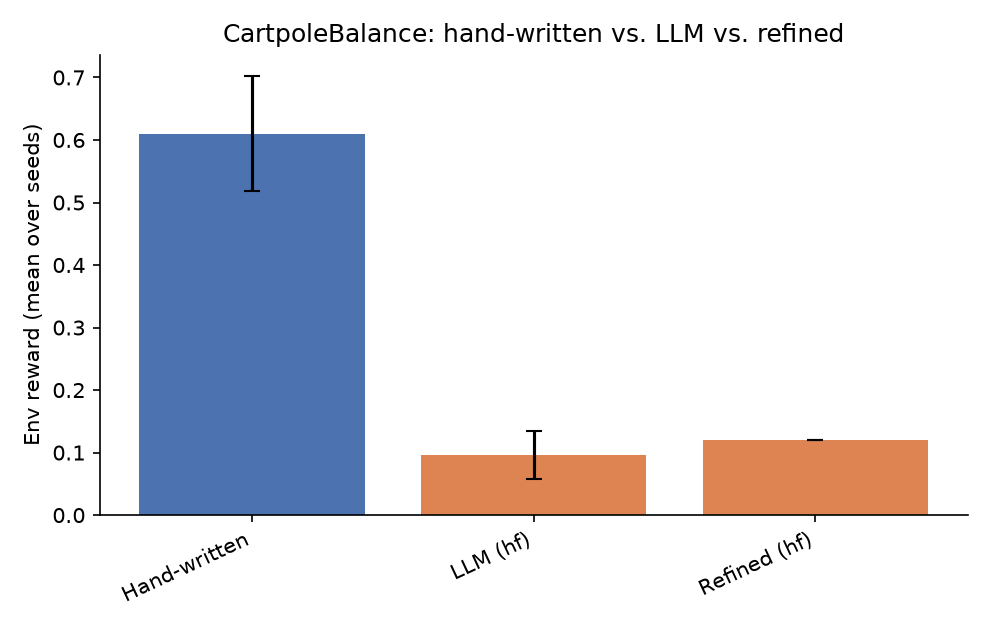
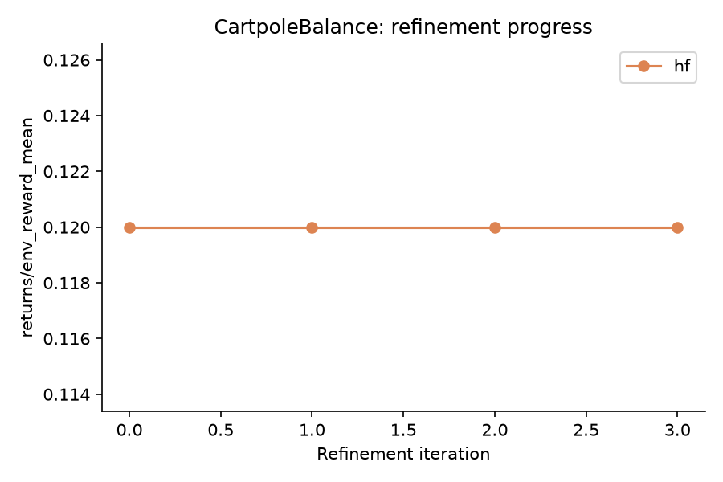

# NEXUS LLM Extension - Results Report

Seeds: [0, 1, 2, 3, 4]  |  Backends: ['hf']

## Summary table

| Env | Backend | Kind | Metric | Mean | Std |
|---|---|---|---|---|---|
| CartpoleBalance | - | hand_written | env_reward | 0.610 | 0.092 |
| CartpoleBalance | - | hand_written | success_rate | 0.318 | 0.054 |
| CartpoleBalance | - | hand_written | goal_metric | 0.541 | 0.086 |
| CartpoleBalance | hf | llm | env_reward | 0.096 | 0.038 |
| CartpoleBalance | hf | llm | success_rate | 0.038 | 0.026 |
| CartpoleBalance | hf | llm | goal_metric | 0.006 | 0.343 |
| CartpoleBalance | hf | refined_first_iter | env_reward | 0.120 | - |
| CartpoleBalance | hf | refined_last_iter | env_reward | 0.120 | - |

## CartpoleBalance

**Comments:**

- **hf**: LLM-generated skills underperformed the hand-written baseline by -0.514 reward (-84.3%).
  Success rate: hand-written 0.318 vs. LLM 0.038.
  Refinement loop did not improve the skillset over 4 iterations (0.120 -> 0.120).
  Skill usage (LLM/hf, avg over seeds): 0_string=1.00 -- dominant skill: `0_string` (1.00).
  Hand-written skill usage (avg over seeds): 0_recover_balance=0.07, 1_center_cart=0.18, 2_damp_motion=0.76