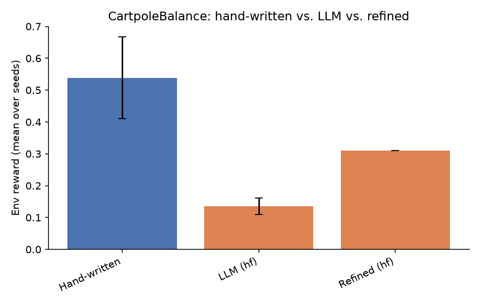
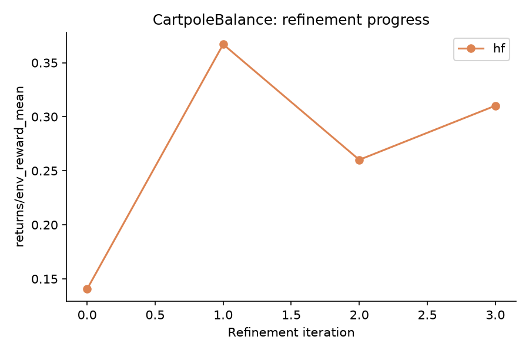

# NEXUS LLM Extension - Results Report

Seeds: [0, 1, 2, 3, 4]  |  Backends: ['hf']

## Summary table

| Env | Backend | Kind | Metric | Mean | Std |
|---|---|---|---|---|---|
| CartpoleBalance | - | hand_written | env_reward | 0.539 | 0.128 |
| CartpoleBalance | - | hand_written | success_rate | 0.415 | 0.214 |
| CartpoleBalance | - | hand_written | goal_metric | 0.663 | 0.304 |
| CartpoleBalance | hf | llm | env_reward | 0.135 | 0.026 |
| CartpoleBalance | hf | llm | success_rate | 0.035 | 0.032 |
| CartpoleBalance | hf | llm | goal_metric | 0.065 | 0.011 |
| CartpoleBalance | hf | refined_first_iter | env_reward | 0.140 | - |
| CartpoleBalance | hf | refined_last_iter | env_reward | 0.310 | - |

## CartpoleBalance

**Comments:**

- **hf**: LLM-generated skills underperformed the hand-written baseline by -0.404 reward (-74.9%).
  Success rate: hand-written 0.415 vs. LLM 0.035.
  Refinement loop improved the skillset over 4 iterations (0.140 -> 0.310).
  Skill usage (LLM/hf, avg over seeds): 0_Initial Balance Check=1.00, 1_Leverage Gravity to Maintain Balance=0.00, 2_Optimize Locomotion for Stability=0.00 -- dominant skill: `0_Initial Balance Check` (1.00).
  Hand-written skill usage (avg over seeds): 0_recover_balance=0.11, 1_center_cart=0.15, 2_damp_motion=0.74