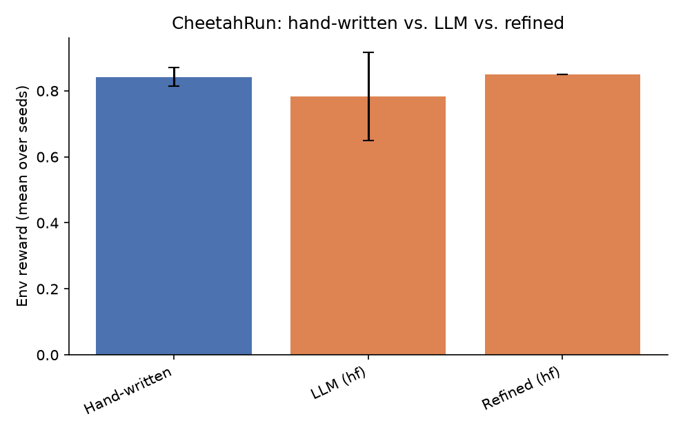
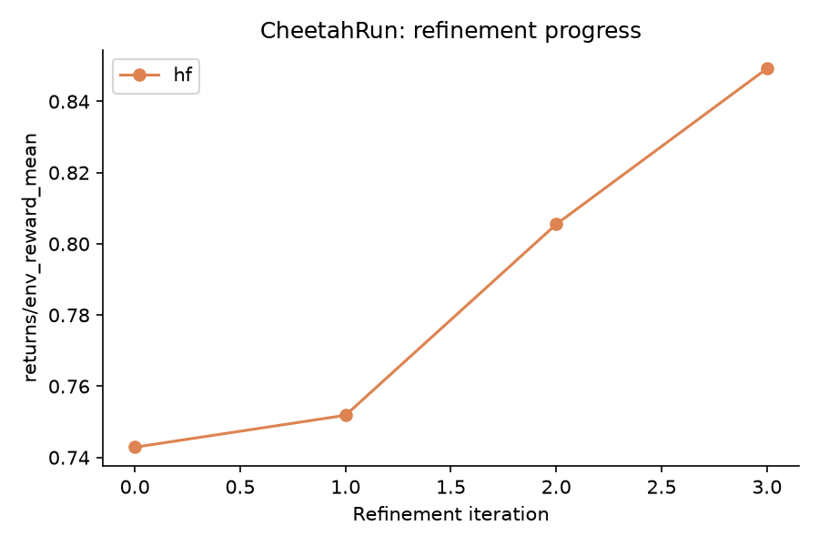

# NEXUS LLM Extension - Results Report

Seeds: [0, 1, 2, 3, 4]  |  Backends: ['hf']

## Summary table

| Env | Backend | Kind | Metric | Mean | Std |
|---|---|---|---|---|---|
| CheetahRun | - | hand_written | env_reward | 0.842 | 0.029 |
| CheetahRun | - | hand_written | success_rate | 0.899 | 0.095 |
| CheetahRun | - | hand_written | goal_metric | 7.994 | 0.951 |
| CheetahRun | hf | llm | env_reward | 0.783 | 0.133 |
| CheetahRun | hf | llm | success_rate | 0.913 | 0.042 |
| CheetahRun | hf | llm | goal_metric | 7.851 | 0.495 |
| CheetahRun | hf | refined_first_iter | env_reward | 0.743 | - |
| CheetahRun | hf | refined_last_iter | env_reward | 0.849 | - |

## CheetahRun

**Comments:**

- **hf**: LLM-generated skills underperformed the hand-written baseline by -0.060 reward (-7.1%).
  Success rate: hand-written 0.899 vs. LLM 0.913.
  Refinement loop improved the skillset over 4 iterations (0.743 -> 0.849).
  Skill usage (LLM/hf, avg over seeds): 0_Initial Stability=0.12, 1_Lateral Locomotion=0.47, 2_Optimal Performance=0.40 -- dominant skill: `1_Lateral Locomotion` (0.47).
  Hand-written skill usage (avg over seeds): 0_accelerate_forward=0.35, 1_stabilize_posture=0.04, 2_energy_efficient_run=0.60