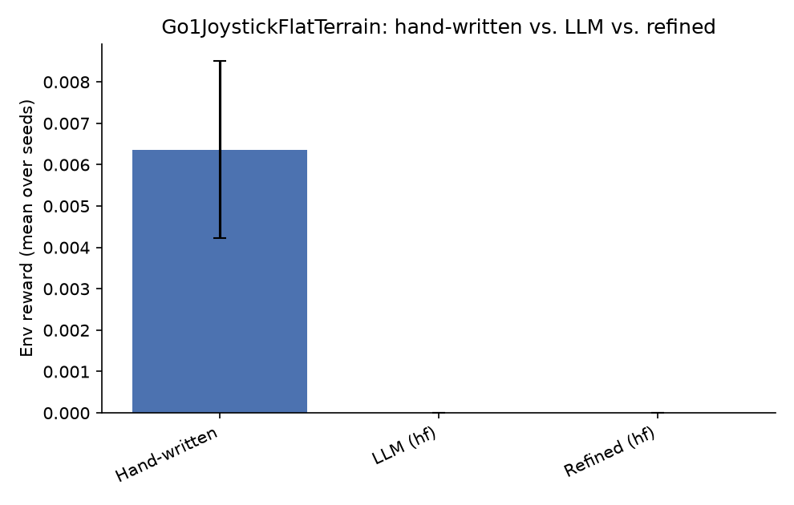
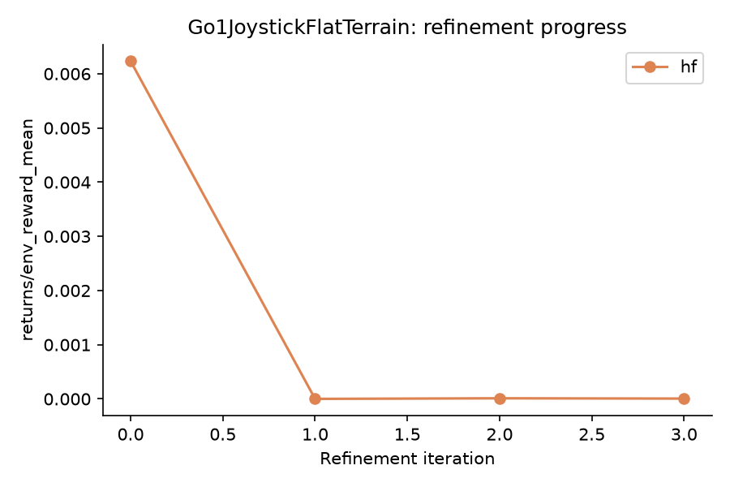

# NEXUS LLM Extension - Results Report

Seeds: [0, 1, 2, 3, 4]  |  Backends: ['hf']

## Summary table

| Env | Backend | Kind | Metric | Mean | Std |
|---|---|---|---|---|---|
| Go1JoystickFlatTerrain | - | hand_written | env_reward | 0.006 | 0.002 |
| Go1JoystickFlatTerrain | - | hand_written | success_rate | 0.284 | 0.084 |
| Go1JoystickFlatTerrain | - | hand_written | goal_metric | -0.924 | 0.052 |
| Go1JoystickFlatTerrain | hf | llm | env_reward | 0.000 | 0.000 |
| Go1JoystickFlatTerrain | hf | llm | success_rate | 0.037 | 0.011 |
| Go1JoystickFlatTerrain | hf | llm | goal_metric | -1.973 | 0.158 |
| Go1JoystickFlatTerrain | hf | refined_first_iter | env_reward | 0.006 | - |
| Go1JoystickFlatTerrain | hf | refined_last_iter | env_reward | 0.000 | - |

## Go1JoystickFlatTerrain

**Comments:**

- **hf**: LLM-generated skills underperformed the hand-written baseline by -0.006 reward (-100.0%).
  Success rate: hand-written 0.284 vs. LLM 0.037.
  Refinement loop did not improve the skillset over 4 iterations (0.006 -> 0.000).
  Skill usage (LLM/hf, avg over seeds): 0_BaseHeightSafety=0.86, 1_LateralMovementControl=0.02, 2_OptimalGait=0.12 -- dominant skill: `0_BaseHeightSafety` (0.86).
  Hand-written skill usage (avg over seeds): 0_stand=0.36, 1_track_velocity=0.20, 2_turn=0.16, 3_recover=0.28