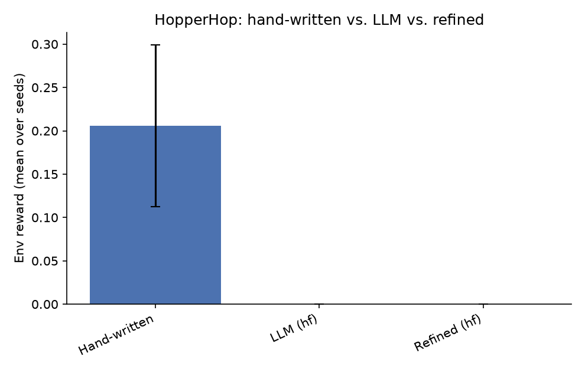
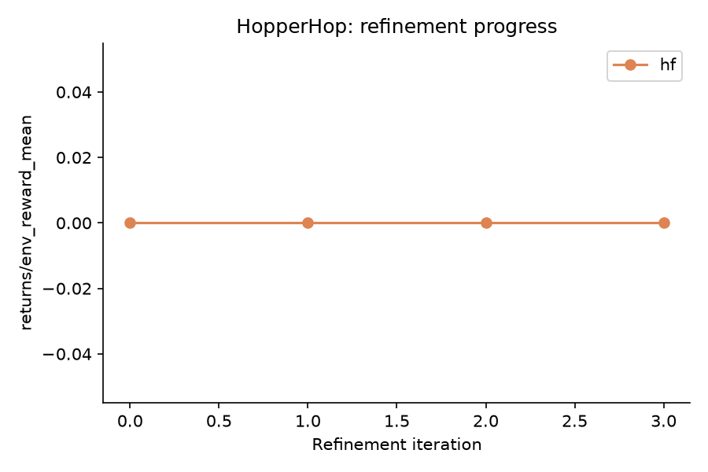

# NEXUS LLM Extension - Results Report

Seeds: [0, 1, 2, 3, 4]  |  Backends: ['hf']

## Summary table

| Env | Backend | Kind | Metric | Mean | Std |
|---|---|---|---|---|---|
| HopperHop | - | hand_written | env_reward | 0.206 | 0.093 |
| HopperHop | - | hand_written | success_rate | 0.241 | 0.053 |
| HopperHop | - | hand_written | goal_metric | 0.975 | 0.189 |
| HopperHop | hf | llm | env_reward | 0.000 | 0.000 |
| HopperHop | hf | llm | success_rate | 0.001 | 0.000 |
| HopperHop | hf | llm | goal_metric | 0.307 | 0.017 |
| HopperHop | hf | refined_first_iter | env_reward | 0.000 | - |
| HopperHop | hf | refined_last_iter | env_reward | 0.000 | - |

## HopperHop

**Comments:**

- **hf**: LLM-generated skills underperformed the hand-written baseline by -0.206 reward (-100.0%).
  Success rate: hand-written 0.241 vs. LLM 0.001.
  Refinement loop did not improve the skillset over 4 iterations (0.000 -> 0.000).
  Skill usage (LLM/hf, avg over seeds): 0_Initial Stability=0.41, 1_Forward Movement=0.01, 2_Optimal Locomotion=0.58 -- dominant skill: `2_Optimal Locomotion` (0.58).
  Hand-written skill usage (avg over seeds): 0_stand_recover=0.19, 1_hop_forward=0.29, 2_stabilize_landing=0.14, 3_energy_efficient=0.37