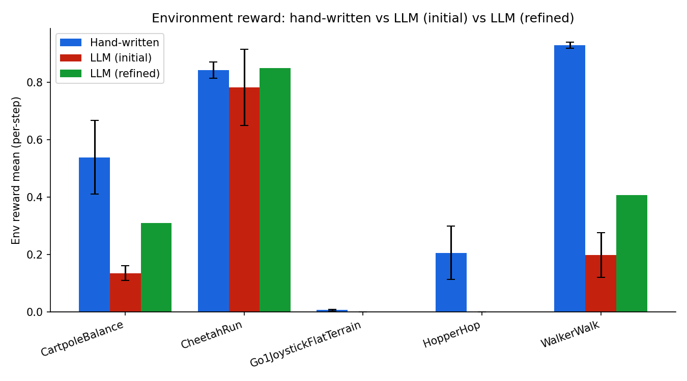
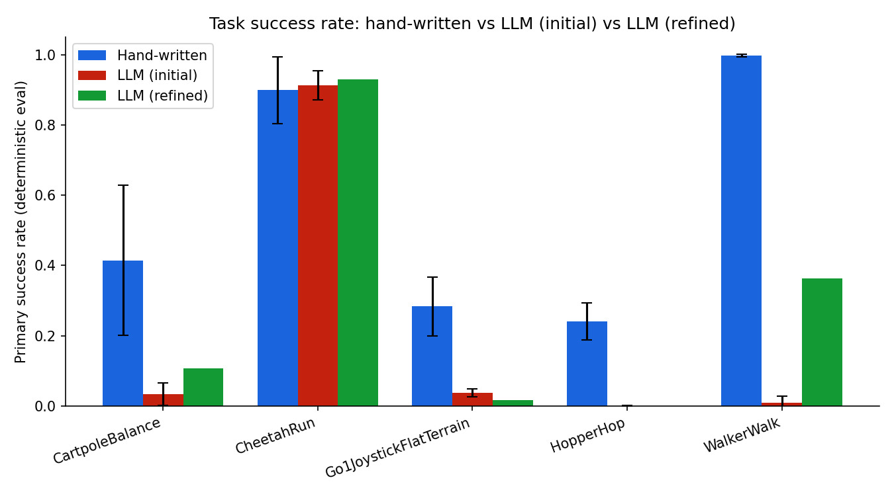
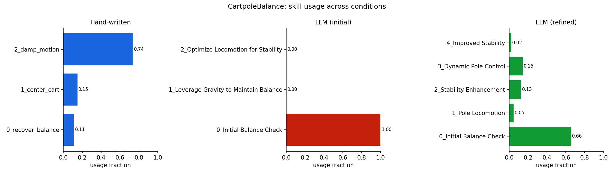
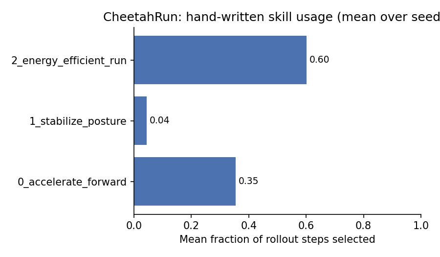
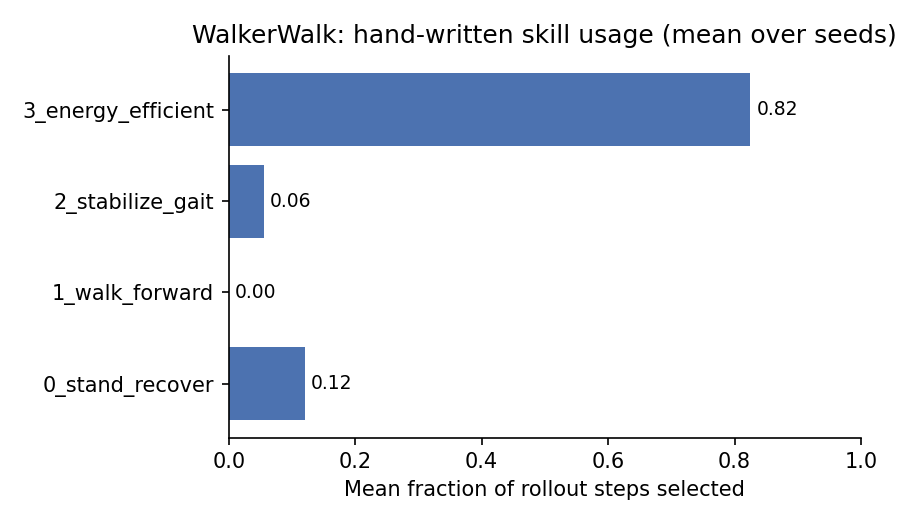
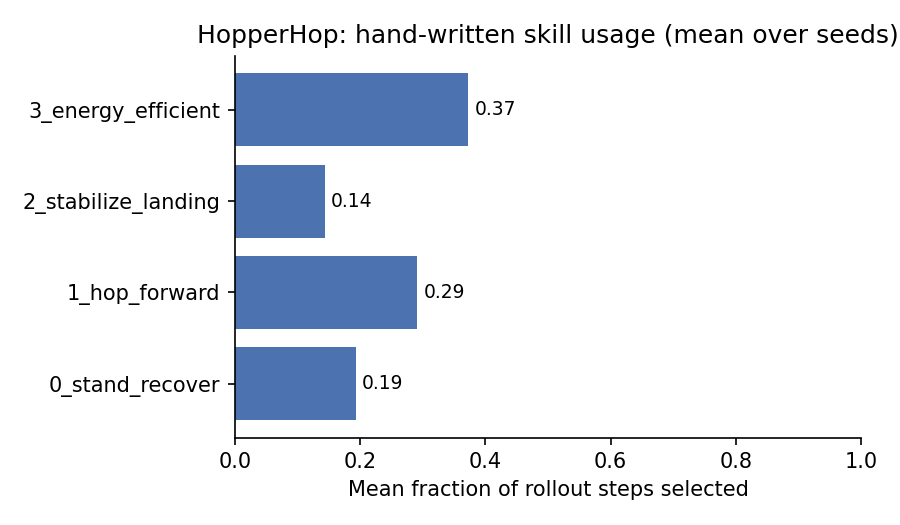
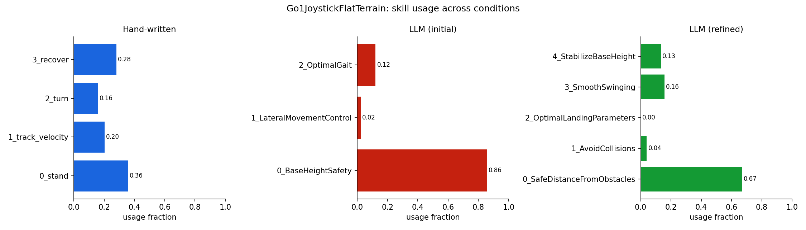
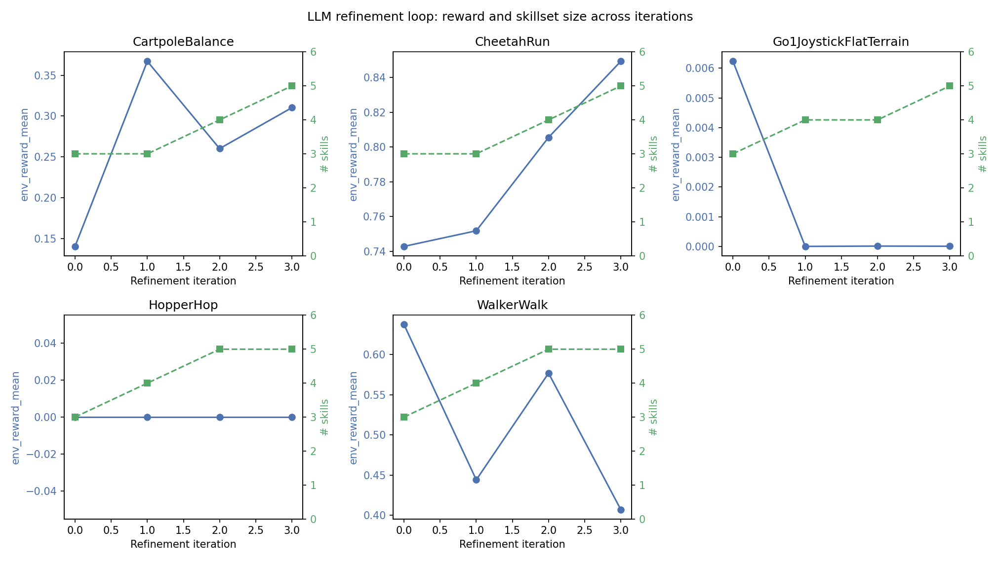

# NEXUS Skill Comparison Report: Hand-written vs LLM-generated vs LLM-refined

Playground environments:

1. **Hand-written** — the symbolic skills/rewards directly from policies written by hand.
2. **LLM (initial)** — a skillset proposed once by an LLM from
   only the environment name, observation schema, and a task description, then
   compiled by the interpreter and trained with the exact
   same config as the hand-written run.
3. **LLM (refined)** — the same LLM, but iterated through
   the refinement loop: propose → train → summarize metrics →
   feed back to the LLM → get an improved skillset, repeated for 4 iterations.

---

## Environments covered

| Env | Config | Hand-written skills | LLM-initial skills | LLM-refined skills |
|---|---|---|---|---|
| CartpoleBalance | `configs/cartpole_balance_nesy.yaml` | `recover_balance`, `center_cart`, `damp_motion` (3) | `Initial Balance Check`, `Leverage Gravity to Maintain Balance`, `Optimize Locomotion for Stability` (3) | 5 skills (grew +2 over 4 iterations) |
| CheetahRun | `configs/cheetah_run_nesy.yaml` | `accelerate_forward`, `stabilize_posture`, `energy_efficient_run` (3) | `Initial Stability`, `Lateral Locomotion`, `Optimal Performance` (3) | 5 skills (grew +2) |
| WalkerWalk | `configs/walker_walk_nesy.yaml` | `stand_recover`, `walk_forward`, `stabilize_gait`, `energy_efficient` (4) | `Initial Balance Check`, `Forward Movement`, `Optimal Locomotion` (3) | 5 skills (grew +2) |
| HopperHop | `configs/hopper_hop_nesy.yaml` | `stand_recover`, `hop_forward`, `stabilize_landing`, `energy_efficient` (4) | `Initial Stability`, `Forward Movement`, `Optimal Locomotion` (3) | 5 skills (grew +2) |
| Go1JoystickFlatTerrain | `configs/go1_joystick_nesy.yaml` | `stand`, `track_velocity`, `turn`, `recover` (4) | `BaseHeightSafety`, `LateralMovementControl`, `OptimalGait` (3) | 5 skills (grew +2) |

All runs used the `nesy` meta-policy (learned meta-Q selects among a
NeSy-masked skill set), 5 seeds for hand-written and LLM-initial,
and a single 4-iteration refinement run per environment.

---

## 1. General results: env reward & success rate

| Env | Hand env-reward | LLM-initial env-reward | Refined env-reward | LLM vs hand (Δ%) | Hand success-rate | LLM-initial success-rate | Refined success-rate |
|---|---|---|---|---|---|---|---|
| CartpoleBalance | 0.539 ± 0.128 | 0.135 ± 0.026 | 0.310 | **−74.9%** | 0.415 ± 0.214 | 0.035 ± 0.032 | 0.108 |
| CheetahRun | 0.842 ± 0.029 | 0.783 ± 0.133 | **0.849** | −7.1% | 0.899 ± 0.095 | 0.913 ± 0.042 | **0.929** |
| WalkerWalk | 0.929 ± 0.011 | 0.199 ± 0.078 | 0.407 | **−78.6%** | 0.997 ± 0.004 | 0.009 ± 0.019 | 0.363 |
| HopperHop | 0.206 ± 0.093 | 0.000 ± 0.000 | 0.000 | **−100.0%** | 0.241 ± 0.053 | 0.001 ± 0.000 | 0.000 |
| Go1JoystickFlatTerrain | 0.0064 ± 0.0021 | ~0.0000 | ~0.0000 | **−99.99%** | 0.284 ± 0.084 | 0.037 ± 0.011 | 0.017 |

**Reading this table:**
- **CheetahRun is the one environment where the LLM is competitive out of the
  box** and the refined skillset actually surpasses the hand-written
  policy on both env reward (0.849 vs 0.842) and success rate (0.929 vs
  0.899). This is the flattest, most forgiving locomotion task (dense forward-velocity
  reward, no balance/contact precondition), which likely explains why a
  generically-worded LLM skillset transfers well.
- **CartpoleBalance and WalkerWalk show the LLM losing ~75–79% of the
  hand-written reward**, though refinement recovers roughly half to two-thirds
  of that gap (WalkerWalk: 0.199 → 0.407; still far below hand-written 0.929).
- **HopperHop and Go1JoystickFlatTerrain are near-total LLM failures.** LLM-initial and
  LLM-refined both land at ~0 env reward for HopperHop, and refinement does not
  help — every iteration in the curve is exactly 0. Go1's LLM-initial reward
  is ~6 orders of magnitude smaller than hand-written, and
  refinement does not recover it. These are also the two hardest tasks
  (contact-precondition hopping, and quadruped balance + command tracking),
  suggesting the LLM's activation rules and reward shaping are least reliable
  exactly where dense, well-conditioned rewards matter most.
- **Success rate collapses even more than env reward** in most environments —
  e.g. WalkerWalk's `primary_success_rate` (net-forward-walk indicator) drops
  from 0.997 (hand) to 0.009 (LLM-initial), a near-complete loss of the actual
  task metric even though env-reward only dropped ~79%. Env reward is an
  average over per-step skill/task reward shaping, while success rate is the harder,
  binary signal, so it's more sensitive to
  degraded skill activation/mask logic.

---

## 2. Skillset structure

| Env | Hand-written (n, names) | LLM-initial (n, names) | LLM-refined (n, names) |
|---|---|---|---|
| CartpoleBalance | 3: recover_balance, center_cart, damp_motion | 3: Initial Balance Check, Leverage Gravity to Maintain Balance, Optimize Locomotion for Stability | 5: Initial Balance Check, Pole Locomotion, Stability Enhancement, Dynamic Pole Control, Improved Stability |
| CheetahRun | 3: accelerate_forward, stabilize_posture, energy_efficient_run | 3: Initial Stability, Lateral Locomotion, Optimal Performance | 5: Initial Balance, Sideways Movement, High-Speed Forward Motion, Steering Maneuver, Dynamic Locomotion |
| WalkerWalk | 4: stand_recover, walk_forward, stabilize_gait, energy_efficient | 3: Initial Balance Check, Forward Movement, Optimal Locomotion | 5: Initial Balance Check, Steady Walking, Smooth Locomotion, Dynamic Stance, Stealthy Movement |
| HopperHop | 4: stand_recover, hop_forward, stabilize_landing, energy_efficient | 3: Initial Stability, Forward Movement, Optimal Locomotion | 5: Initial Balance, Forward Momentum, Efficient Locomotion, Stability Enhancement, Dynamic Stabilization |
| Go1JoystickFlatTerrain | 4: stand, track_velocity, turn, recover | 3: BaseHeightSafety, LateralMovementControl, OptimalGait | 5: SafeDistanceFromObstacles, AvoidCollisions, OptimalLandingParameters, SmoothSwinging, StabilizeBaseHeight |

**Observations:**
- **The LLM always proposes exactly 3 skills initially and the refinement
  loop always grows to 5 skills** (the schema's stated max) by the final
  iteration, in every single environment. This looks like a systematic
  refinement bias toward adding rather than fizing the weaker skills.
- **LLM skill names are generic and cross-environment**
  ("Initial Balance Check", "Optimal Locomotion", "Stability Enhancement"
  appear across CartpoleBalance/WalkerWalk/HopperHop) — a signal
  that the LLM is pattern-completing a locomotion-skill template rather than
  reasoning about the specific observation schema. The hand-written names are more
  concrete and env-specific (`center_cart`, `stabilize_gait`, `track_velocity`).
- Go1's refined names (`SafeDistanceFromObstacles`, `AvoidCollisions`,
  `OptimalLandingParameters`) reference concepts (obstacles, landing) that do
  not exist in the Go1 joystick task's observation schema at all — a
  concrete case of skill  hallucination that likely
  contributes to Go1's near-zero LLM reward.

---

## 3. Skill usage

| Env | Hand-written top skill (usage) | LLM-initial top skill (usage) | LLM-refined top skill (usage) |
|---|---|---|---|
| CartpoleBalance | damp_motion (0.74) | Initial Balance Check (1.00 — only skill ever selected) | (see plot) |
| CheetahRun | energy_efficient_run (0.60) | Lateral Locomotion (0.47) | (see plot) |
| WalkerWalk | energy_efficient (0.82) | Forward Movement (0.86) | Initial Balance Check (0.64) |
| HopperHop | energy_efficient (0.37) | Optimal Locomotion (0.58) | (see plot) |
| Go1JoystickFlatTerrain | stand (0.36) | BaseHeightSafety (0.86) | (see plot) |

**Observations:**
- **CartpoleBalance's LLM-initial skillset collapses to a single skill**:
  `Initial Balance Check` is selected 100% of the time, the other two skills
  0%. This is the classic "mutually-exclusive activation rules that are all
  simultaneously true" degeneracy the NeSy mask code specifically guards
  against with a `mask_mode="progressive"` option. This run used the default
  "strict" mode, so the collapse was not mitigated.
- **The hand-written policies show a healthy, non-degenerate usage
  distribution in every environment**. No skill is ever exactly 0% or 100%
  except WalkerWalk's `walk_forward` (0.00, because `energy_efficient` already
  subsumes forward progress once walking is established.
- **WalkerWalk's LLM-refined skillset still leans heavily on the first,
  safety-flavored skill** (`Initial Balance Check`, 64%) rather than a
  locomotion skill, consistent with its low 0.363 success rate versus
  hand-written's 0.997. The refined meta-policy is still spending most of its
  time being cautious rather than walking forward.

---

## 4. Refinement loop

| Env | iter 0 reward → iter 3 reward | iter 0 → iter 3 skills | Monotonic improvement? |
|---|---|---|---|
| CartpoleBalance | 0.140 → 0.310 (peaked 0.367 at iter 1) | 3 → 5 | No — non-monotonic, best at iter 1 |
| CheetahRun | 0.743 → **0.849** | 3 → 5 | **Yes** — steady improvement every iteration |
| WalkerWalk | 0.637 → 0.407 | 3 → 5 | **No — net regression**, best at iter 0 |
| HopperHop | 0.000 → 0.000 | 3 → 5 | No signal at all (flat zero throughout) |
| Go1JoystickFlatTerrain | 0.0062 → 0.0000059 | 3 → 5 | **No — collapses after iter 0** and never recovers |

**Observations:**
- **The refinement loop only reliably helps on CheetahRun**, the environment
  where the LLM was already closest to hand-written performance. On the three
  hardest environments (WalkerWalk, HopperHop, Go1), more
  refinement iterations either do nothing (HopperHop stays at exactly 0
  for all 4 iterations) or actively hurt (Go1 drops ~3 orders of magnitude
  from iteration 0 to iteration 1 and never recovers; WalkerWalk's best
  iteration is iteration 0, before any feedback-driven revision).
- **`skill_reward_mean` (the mean of the *per-skill* shaped rewards, as opposed
  to env reward) does not track env reward well**, e.g. CartpoleBalance's
  `skill_reward_mean` is deeply negative and gets more negative even as env
  reward improves (iter 0: −0.32 → iter 2: −0.99 while env reward rose
  0.14 → 0.26). This means the LLM's self-reported reward shaping is not a
  reliable proxy for the metric that actually matters, which limits how well
  the refinement loop's own feedback signal (`summarize_metrics`, which
  includes `skill_reward_mean`) can guide improvement.

---

## Further notes

- Seed counts differ by condition. Hand-written and LLM-initial are each
  averaged over 5 seeds (`seeds: [0,1,2,3,4]`); the ± std reflects real
  seed variance. **The refinement loop is not multi-seeded, each
  environment's refinement curve is a
  single training run per iteration.** Treat "refined" numbers as one sample,
  not a seed-averaged estimate; a wider multi-seed refinement sweep would be
  needed before treating small refined-vs-LLM-initial deltas as significant.
  
- **The LLM skillset used for the 5-seed LLM-initial comparison is a
  different LLM sample than refinement iteration 0**, even though both are
  "the first thing the LLM proposed" for that environment . They come from independent calls to the
  generation prompt, another reason to read exact refined-vs-initial
  deltas with caution.
  
- **`env_reward_mean` is a per-step, not per-episode, reward**, and its scale
  is set by each environment's hand-written reward shaping — 0.85 in
  CheetahRun and 0.0064 in Go1JoystickFlatTerrain are not on a comparable
  footing. Cross-environment comparisons never use raw reward magnitude across environments.
  `primary_success_rate` is the more cross-comparable, task-defined metric
  in [0, 1].

---
