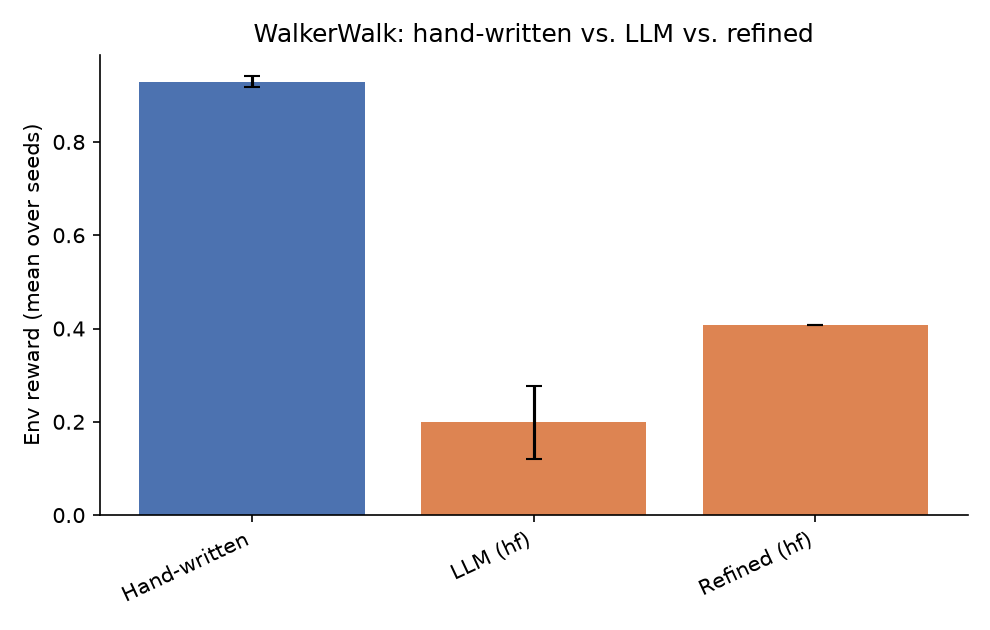
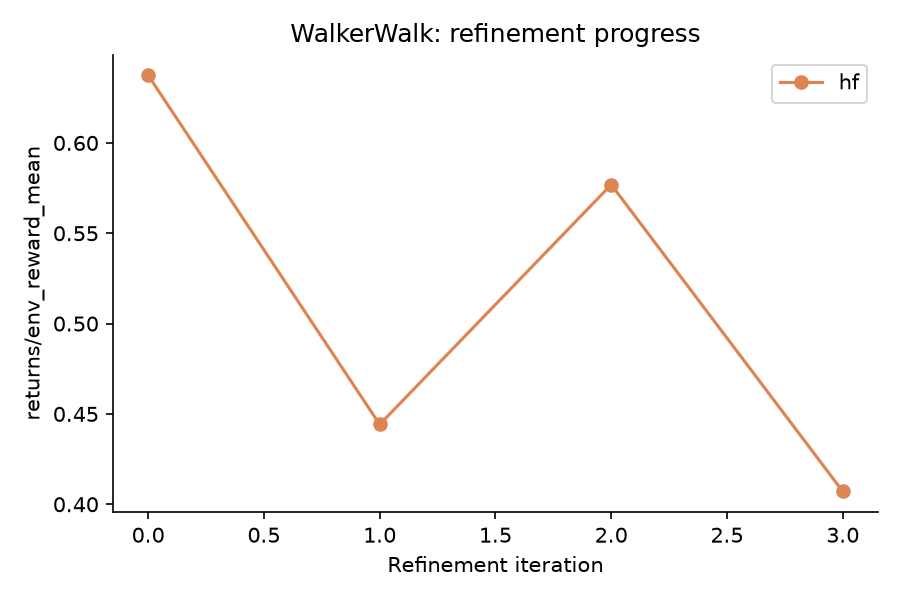

# NEXUS LLM Extension - Results Report

Seeds: [0, 1, 2, 3, 4]  |  Backends: ['hf']

## Summary table

| Env | Backend | Kind | Metric | Mean | Std |
|---|---|---|---|---|---|
| WalkerWalk | - | hand_written | env_reward | 0.929 | 0.011 |
| WalkerWalk | - | hand_written | success_rate | 0.997 | 0.004 |
| WalkerWalk | - | hand_written | goal_metric | 6.299 | 0.523 |
| WalkerWalk | hf | llm | env_reward | 0.199 | 0.078 |
| WalkerWalk | hf | llm | success_rate | 0.009 | 0.019 |
| WalkerWalk | hf | llm | goal_metric | 4.120 | 0.759 |
| WalkerWalk | hf | refined_first_iter | env_reward | 0.637 | - |
| WalkerWalk | hf | refined_last_iter | env_reward | 0.407 | - |

## WalkerWalk

**Comments:**

- **hf**: LLM-generated skills underperformed the hand-written baseline by -0.730 reward (-78.6%).
  Success rate: hand-written 0.997 vs. LLM 0.009.
  Refinement loop did not improve the skillset over 4 iterations (0.637 -> 0.407).
  Skill usage (LLM/hf, avg over seeds): 0_Initial Balance Check=0.14, 1_Forward Movement=0.86, 2_Optimal Locomotion=0.00 -- dominant skill: `1_Forward Movement` (0.86).
  Hand-written skill usage (avg over seeds): 0_stand_recover=0.12, 1_walk_forward=0.00, 2_stabilize_gait=0.06, 3_energy_efficient=0.82