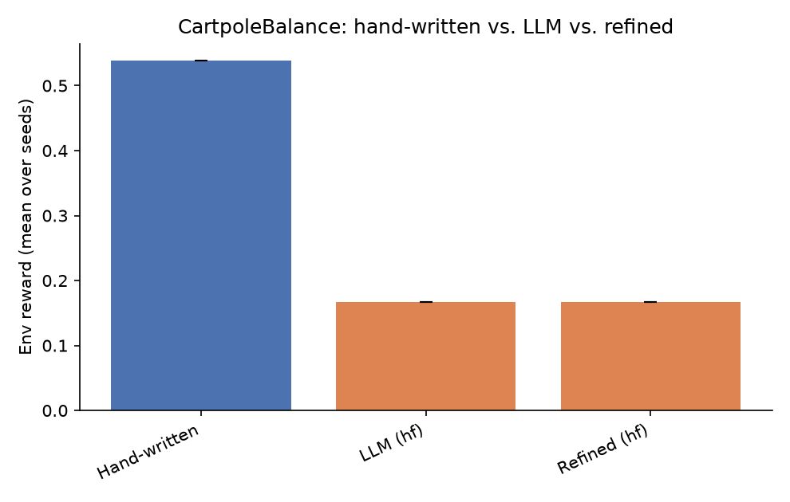
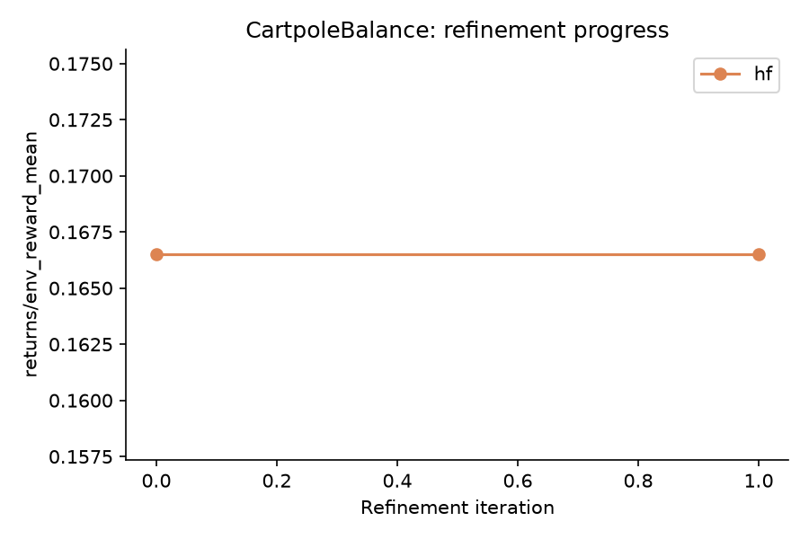

# NEXUS LLM Extension - Results Report

Seeds: [0]  |  Backends: ['hf']

## Summary table

| Env | Backend | Kind | Metric | Mean | Std |
|---|---|---|---|---|---|
| CartpoleBalance | - | hand_written | env_reward | 0.538 | 0.000 |
| CartpoleBalance | - | hand_written | success_rate | 0.080 | 0.000 |
| CartpoleBalance | - | hand_written | goal_metric | -0.178 | 0.000 |
| CartpoleBalance | hf | llm | env_reward | 0.166 | 0.000 |
| CartpoleBalance | hf | llm | success_rate | 0.019 | 0.000 |
| CartpoleBalance | hf | llm | goal_metric | 0.060 | 0.000 |
| CartpoleBalance | hf | refined_first_iter | env_reward | 0.166 | - |
| CartpoleBalance | hf | refined_last_iter | env_reward | 0.166 | - |

## CartpoleBalance

**Comments:**

- **hf**: LLM-generated skills underperformed the hand-written baseline by -0.372 reward (-69.1%).
  Success rate: hand-written 0.080 vs. LLM 0.019.
  Refinement loop did not improve the skillset over 2 iterations (0.166 -> 0.166).
  Skill usage (LLM/hf, avg over seeds): 0_string=1.00 -- dominant skill: `0_string` (1.00).
  Hand-written skill usage (avg over seeds): 0_recover_balance=0.06, 1_center_cart=0.03, 2_damp_motion=0.91